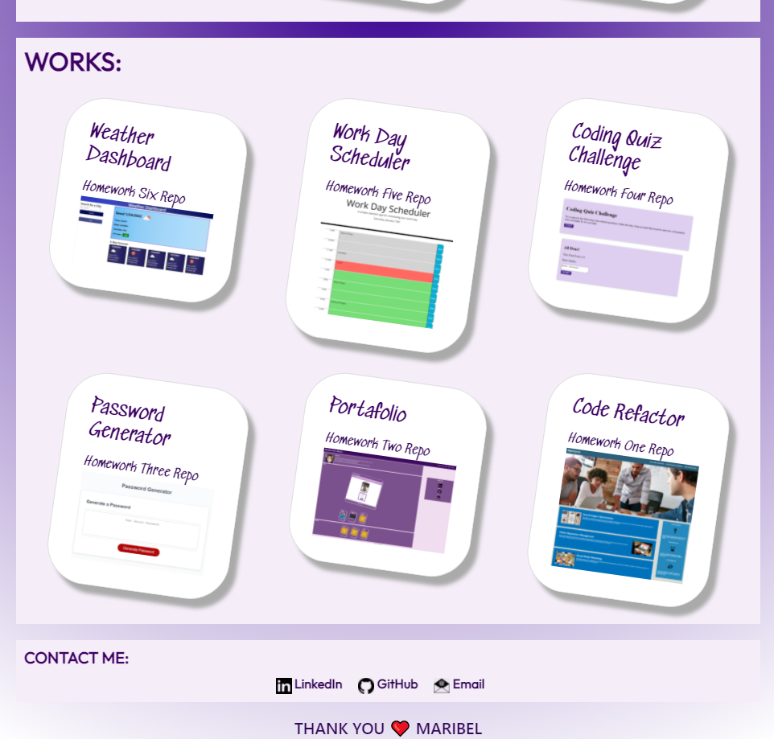

# Homework Unit Eight:
# Portafolio

## Description of the homework:

In this homework, I created my portafolio with the latest homeworks assigments and the project one assigment. I used th layout on the previous portafolio assigment in homework two, and updated it using what i have learned so far in class.

The page displays a planner with timeblocks for standard business hours. Each timeblock is color coded to indicate whether the event in the planner is in the past, in the preset, or in the future. Each timeblock has a save button. When a message is inputted in the timeblock and the user has pressed saved, the message will be saved on the local storage to load anytime the user refreshes the page. When a new day starts, the planner resets to start a new day.

In this homework, I used, jQuery, moment, bootstrap, and javascript to create the planner. 

### Link to application [HERE](https://marymd98.github.io/Resume/)

## Screenshot  of Portafolio:
Below are screenshots of my Portafolio. 

